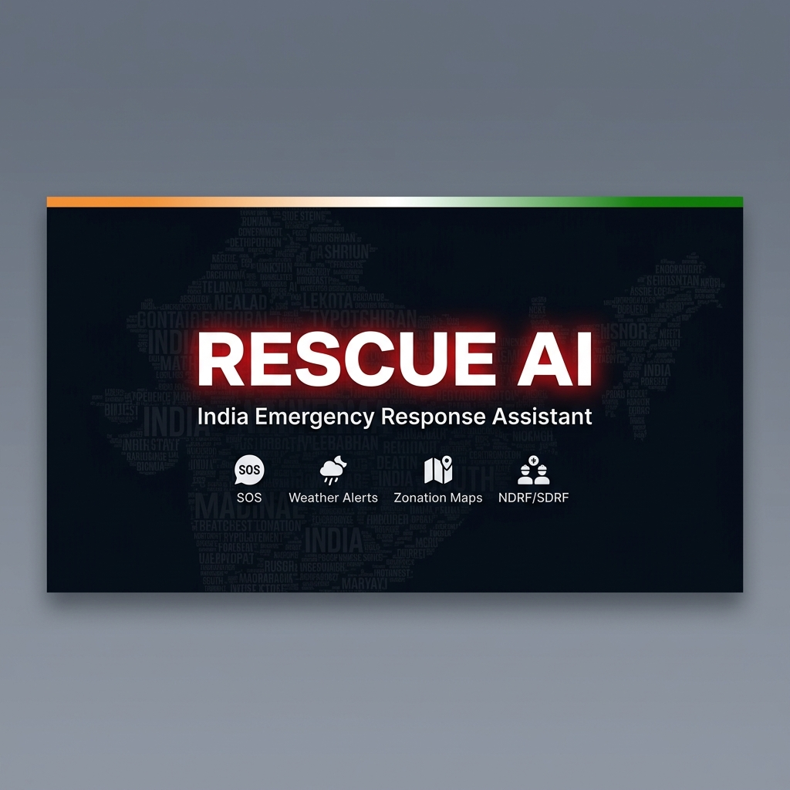
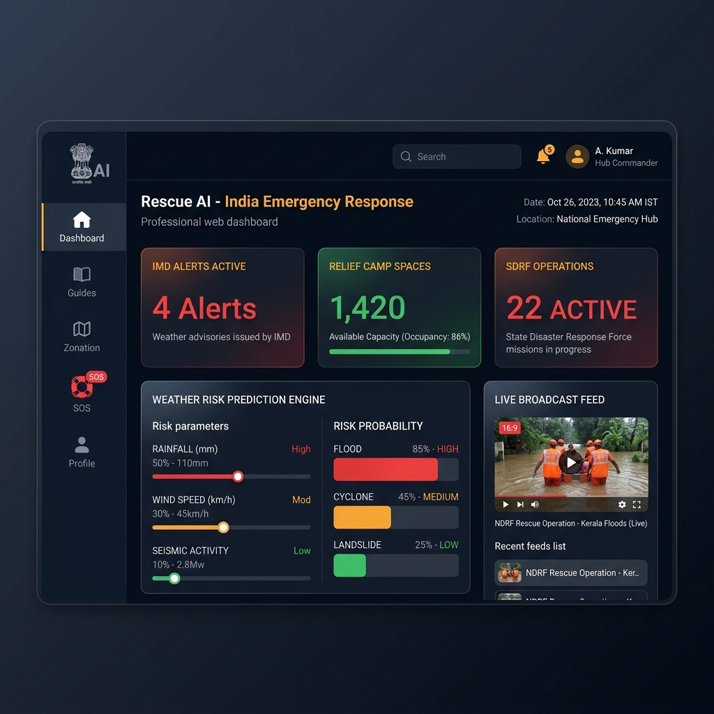
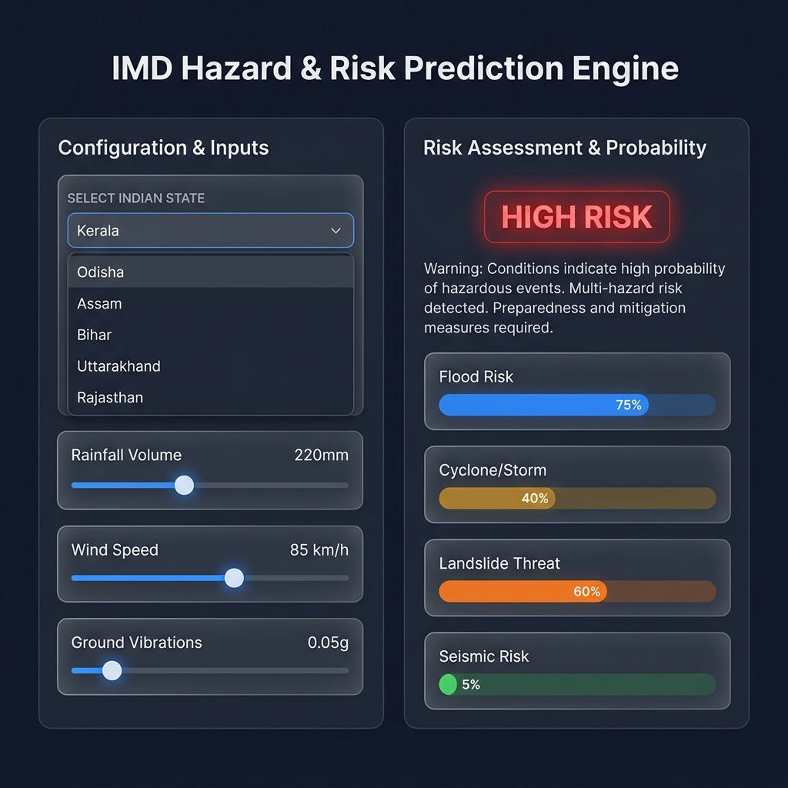
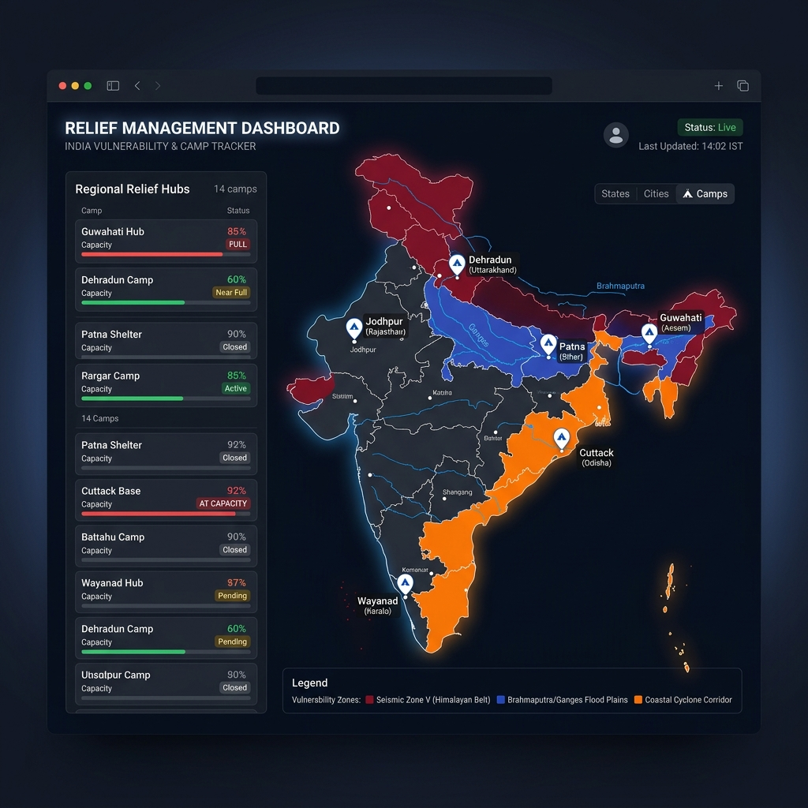
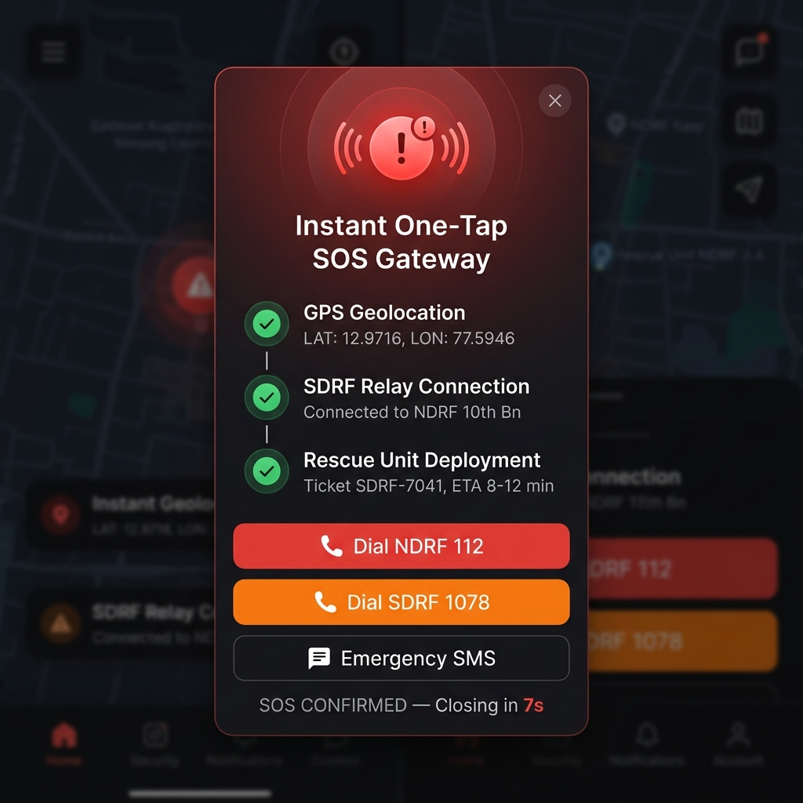

<p align="center">
  
</p>

<h1 align="center">🇮🇳 Rescue AI — India Emergency Response Assistant</h1>

<p align="center">
  <strong>An AI-powered disaster management and emergency response portal built for India</strong><br>
  Aligned with NDMA (National Disaster Management Authority) & SDRF/NDRF operational protocols.
</p>

<p align="center">
  
  
  
  
</p>

---

## 📖 About the Project

**Rescue AI** is a comprehensive disaster management web application designed specifically for the Indian context. It provides real-time hazard monitoring, vulnerability zonation, emergency SOS dispatch, and survival resources — all aligned with India's National Disaster Management Authority (NDMA) and State Disaster Response Force (SDRF) protocols.

The platform aims to bridge the critical gap between disaster prediction and emergency response by empowering citizens with life-saving tools during floods, cyclones, earthquakes, landslides, and droughts.

### 🎯 Problem Statement
India faces recurrent natural disasters — floods in Assam & Bihar, cyclones in Odisha & Andhra Pradesh, earthquakes in Uttarakhand & the Northeast, and droughts in Rajasthan. During emergencies, citizens often struggle with:
- Delayed access to official weather warnings
- Difficulty reaching rescue services (NDRF/SDRF)
- No real-time knowledge of nearby relief camps or safe evacuation routes
- Lack of offline-accessible survival information

**Rescue AI solves all of these problems in a single, offline-capable web portal.**

---

## ✨ Key Features

### 📊 1. National Dashboard with IMD Weather Alerts
Real-time monitoring of active IMD (India Meteorological Department) weather alerts, relief camp occupancy, and ongoing SDRF rescue operations across India.

<p align="center">
  
</p>

---

### 🌦️ 2. AI Hazard & Risk Prediction Engine
An interactive prediction engine that forecasts disaster risk based on adjustable parameters:
- **Rainfall Volume** (mm)
- **Wind Speed** (km/h)
- **Ground Vibrations / Seismic PGA** (g)

Calculates probability percentages for **Flood**, **Cyclone**, **Landslide**, and **Seismic** risks for 6 major disaster-prone Indian states.

<p align="center">
  
</p>

---

### 🗺️ 3. Vulnerability Zonation Map
Interactive SVG map of India highlighting three major hazard zones:
- 🔴 **Seismic Zone IV/V** — Himalayan belt (Uttarakhand, J&K, Northeast)
- 🔵 **Flood Plains** — Brahmaputra Valley, Indo-Gangetic belt
- 🟠 **Cyclone Corridor** — Eastern coastal belt (Odisha, Andhra Pradesh, Tamil Nadu)

Includes pin markers for **6 NDRF/SDRF Relief Camps** with real-time occupancy data.

<p align="center">
  
</p>

---

### 🚨 4. One-Tap SOS Emergency Gateway
The most critical feature — a **zero-hassle SOS dispatch system** that works with a single tap:

1. 📡 **Auto-detects GPS location** from the device
2. 🔄 **Routes to nearest SDRF/NDRF command center**
3. ✅ **Issues a rescue ticket** with ETA confirmation
4. 📞 **Direct dial buttons** for NDRF (112) and SDRF (1078)
5. 💬 **One-tap SMS** with Google Maps location link

<p align="center">
  
</p>

---

### 📖 5. NDRF Survival Guides
Localized NDMA-aligned Standard Operating Procedures for 5 major hazard types:
- 🌊 Monsoon Flood Survival
- 🌀 Coastal Cyclone Response
- ⛰️ Himalayan Earthquake SOP
- ☀️ Heatwave & Drought Management
- 🚗 Industrial & Road Accident Response

Each guide includes **action directives** and a **household emergency kit checklist**.

---

### 🧭 6. Evacuation Route Planner
State-wise evacuation routing with:
- Visual path rendering on the SVG map
- Distance and time estimates
- ⚠️ Hazard warnings along the route
- Safe vs. dangerous route options

---

### 🎒 7. Indian Rations Calculator
Calculates emergency supplies based on family size and duration:
- 💧 Clean drinking water (3L/person/day)
- 🍚 Dry food rations (Rice, Dal, ORS)
- 🩹 Medical kit requirements
- 🔦 Emergency gear kits
- Supports **infant supplement** calculations
- **One-click copy** to clipboard

---

## 🏗️ Architecture & Tech Stack

| Component | Technology |
|-----------|-----------|
| Frontend | HTML5, CSS3, Vanilla JavaScript |
| Styling | Custom CSS with CSS Variables (Dark Theme) |
| Typography | Google Fonts (Inter, Outfit) |
| Maps | Custom SVG with interactive overlays |
| Animations | CSS Keyframes + JS transitions |
| Data | Client-side state management |
| Offline Support | localStorage caching |
| Hosting | GitHub Pages / Python HTTP Server |

### Project Structure
```
rescue-ai/
├── index.html          # Main application entry point
├── styles.css          # Complete design system (1600+ lines)
├── app.js              # Application logic & state management
├── assets/             # README images and screenshots
│   ├── banner.png
│   ├── dashboard.png
│   ├── sos-modal.png
│   ├── zonation-map.png
│   └── weather-predictor.png
├── .gitignore
└── README.md
```

---

## 🚀 Getting Started

### Prerequisites
- A modern web browser (Chrome, Firefox, Edge)
- Python 3.x (for local development server)

### Run Locally
```bash
# Clone the repository
git clone https://github.com/iamanirban99/rescue-ai.git
cd rescue-ai

# Start local server
python -m http.server 8000

# Open in browser
# Navigate to http://localhost:8000
```

### Deploy to GitHub Pages
1. Fork this repository
2. Go to **Settings** → **Pages**
3. Set branch to `main` / `master` → `/ (root)`
4. Your site will be live at `https://yourusername.github.io/rescue-ai/`

---

## 📱 Application Workflow

```
┌─────────────────────────────────────────────────────────┐
│                    RESCUE AI PORTAL                      │
├─────────┬───────────────────────────────────────────────┤
│         │                                               │
│  📊     │  ┌─────────┐ ┌─────────┐ ┌─────────┐         │
│  NAV    │  │IMD Alert│ │Camp Occ.│ │SDRF Ops │         │
│  BAR    │  └────┬────┘ └─────────┘ └─────────┘         │
│         │       │                                       │
│  📖     │  ┌────▼────────────────────────────┐          │
│  GUIDES │  │  AI RISK PREDICTION ENGINE      │          │
│         │  │  Rainfall ──▶ Flood Risk: 75%   │          │
│  🗺️     │  │  Wind ──────▶ Cyclone: 40%      │          │
│  ZONES  │  │  Seismic ──▶ Landslide: 60%    │          │
│         │  └─────────────────────────────────┘          │
│  🧭     │                                               │
│  ROUTE  │  ┌─────────────────────────────────┐          │
│         │  │  IMD LIVE BROADCASTS             │          │
│  📣     │  │  ⚠️ Cyclone warning...           │          │
│  SOS ◄──┼──┤  📡 Flood advisory...           │          │
│         │  └─────────────────────────────────┘          │
│  🎒     │                                               │
│  RATION │  ┌─────────────────────────────────┐          │
│         │  │  🚨 ONE-TAP SOS GATEWAY          │          │
│         │  │  GPS ✅ → SDRF ✅ → DEPLOY ✅     │          │
│         │  │  📞 112  📞 1078  💬 SMS          │          │
│         │  └─────────────────────────────────┘          │
└─────────┴───────────────────────────────────────────────┘
```

---

## 🇮🇳 Indian Disaster Context

| Disaster | Affected States | Annual Impact |
|----------|----------------|--------------|
| 🌊 Floods | Assam, Bihar, Kerala, W. Bengal | 20M+ displaced annually |
| 🌀 Cyclones | Odisha, A.P., Tamil Nadu | Coastal communities at risk |
| ⛰️ Earthquakes | Uttarakhand, J&K, NE India | Seismic Zone IV/V |
| 🏔️ Landslides | Uttarakhand, Kerala, Himachal | Monsoon-triggered |
| ☀️ Droughts | Rajasthan, Maharashtra, Karnataka | Water table depletion |

### Emergency Helplines (India)
| Service | Number |
|---------|--------|
| 🚨 National Emergency | **112** |
| 🔥 NDRF (Rescue) | **011-24363260** |
| 🏥 Ambulance | **108** |
| 🌊 Flood / Disaster | **1078 (SDRF)** |
| 👮 Police | **100** |

---

## 🤝 Contributing

Contributions are welcome! If you'd like to improve Rescue AI:

1. **Fork** the repository
2. **Create** a feature branch (`git checkout -b feature/new-feature`)
3. **Commit** your changes (`git commit -m 'Add new feature'`)
4. **Push** to the branch (`git push origin feature/new-feature`)
5. Open a **Pull Request**

---

## 📄 License

This project is licensed under the **MIT License** — see the [LICENSE](LICENSE) file for details.

---

## 👨‍💻 Author

**Anirban** — [@iamanirban99](https://github.com/iamanirban99)

---

<p align="center">
  <strong>🇮🇳 Built with ❤️ for India's Disaster Resilience 🇮🇳</strong><br>
  <em>Every second counts in a disaster. Rescue AI ensures no second is wasted.</em>
</p>
